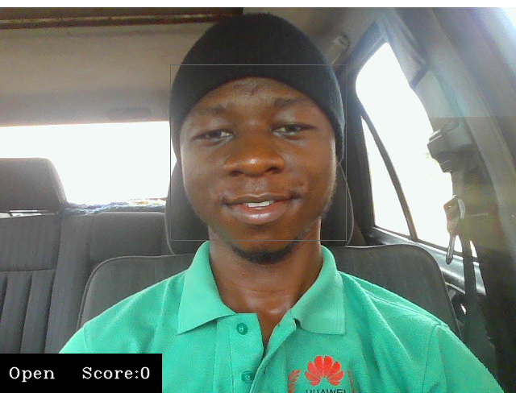

# Drowsiness/Sleep Detection with ML

## General Information
This is a simple computer vision project built with Tensorflow.<br/>
Most Accidents as we know today are likely as a result of sleep/drowsiness of the
drivers (during the day or night).<br/>
To reduce the rate of this occurrence, this project uses a CNN powered model that could be embedded 
in vehicles to raise an alarm when a driver falls asleep. The fun part of this project is that
I used the same alarm Gilfoyle used in Silicon valley for his Bitcoin alarm (Napalm death Scum).

## Installation
Create a virtual env, then
Use the package manager [pip](https://pip.pypa.io/en/stable/) to install all required libraries:

- tensorflow
- numpy


```bash
pip install <package_name>
```

Activate virtual env and `cd` into directory.


## Technologies Used
- Machine Learning
- Tensorflow

### Sample Images below:





## Contributing
Pull requests are welcome. Contributions are what make the open source community such an amazing place to learn, inspire, and create. Any contributions you make are greatly appreciated.

If you have a suggestion that would make this better, please fork the repo and create a pull request.
You can also simply open an issue with the tag "enhancement". Don't forget to give the project a star! Thanks again!


## Contributors
- Benjamin


## Contact Information
[Linkedin](https://www.linkedin.com/in/onyedikachi-benjamin-ogbonna-218404177/)

[Portfolio](http://benjaminogbonna.github.io/)

## License
[MIT](https://choosealicense.com/licenses/mit/)
